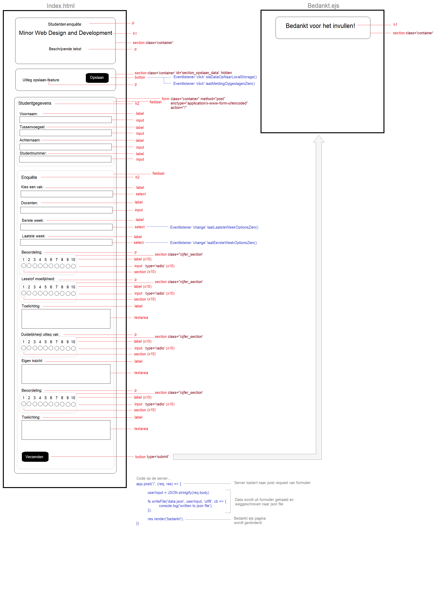
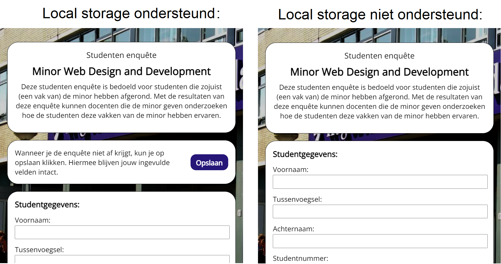
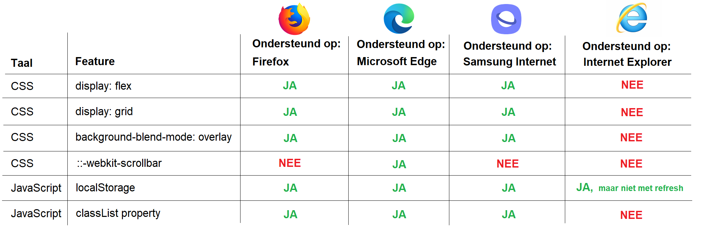
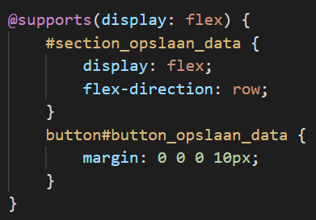
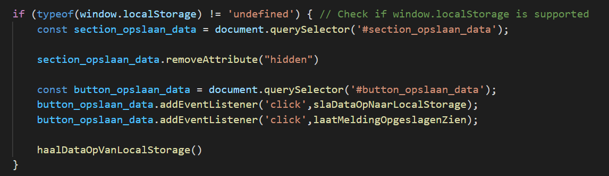

# Studenten enquête
Link naar live demo: https://studentenenquete500895931.herokuapp.com/

Dit project is een studenten enquête in de vorm van een website waarbij het progressive enhancement principe is toegepast. Deze studenten enquête is bedoeld voor studenten die zojuist (een vak van) de minor hebben afgerond. Met de resultaten van deze enquête is het de bedoeling dat docenten die de minor geven kunnen onderzoeken hoe de studenten deze vakken van de minor hebben ervaren.

## Use case
Bij dit project hoort de volgende use case:
'Ik wil een enquête kunnen invullen over de minor Web Development, met verschillende antwoordmogelijkheden. Als ik de enquête niet afkrijg, wil ik later weer verder gaan met waar ik ben gebleven. Alles moet zijn ingevuld voordat je verder mag met het formulier (validatie). Geef duidelijke foutmeldingen'.

Het is hierbij erg belangrijk om goed de core functionality duidelijk te hebben. Er staan in de use case namelijk een aantal kenmerken waar in dit project aan voldaan moet worden.

Met het begrip 'core functionality' wordt bedoeld wat de gebruiker te allen tijde moet kunnen doen op de website. Het mag niet uitmaken met welk type browser, visuele beperking, netwerksnelheid, type device (met of zonder muis/trackpad) en andere beperkende factoren de gebruiker te maken heeft. De core functionality is het gedeelte wat altijd moet werken.

Als we teruggaan naar de use case, staat dat er een enquête moet kunnen worden ingevuld met verschillende antwoordmogelijkheden. Het moge duidelijk zijn dat dit een core functionaliteit is. Als de enquête niet kan worden ingevuld (en verstuurd), dan heb je als gebruiker niks aan de website.

Wat interessanter is, is dat er ook in de use case staat dat de gebruiker na een eventuele onderbreking weer verder wilt gaan waar hij/zij is gebleven. Dit klinkt belangrijk, maar is geen core functionaliteit. Als deze functie er niet is, kun je als gebruiker nog steeds de enquête invullen en versturen. Deze functionaliteit kan dus meer gezien worden als een 'nice to have'.

Ook staat er dat er een validatie op de invoervelden moet zijn. Alle invoervelden zouden immers ingevuld moeten zijn, voordat het formulier verstuurd kan worden. Ook dit is echter geen core functionaliteit, om dezelfde reden als de onderbreking-functionaliteit.

Doordat het een core functionaliteit is dat de data op de server wordt opgevangen, heb ik ervoor gekozen om de verstuurde data op te vangen op de server en niet op de client. Wanneer je de ingevoerde data uit het formulier client-side met JavaScript zou opvangen, dan zouden we problemen krijgen op het moment dat JavaScript niet werkt. Het server-side opvangen van de data is dus volgens het principe van progressive enhancement.

## Breakdown schets
Hieronder heb ik een breakdown schets van de HTML-structuur (en enkele belangrijke kenmerken) van de website gemaakt.

Bij mijn breakdown schets wordt snel duidelijk wat de core functionality is: de gebruiker moet een HTML formulier (de enquête in kunnen vullen en deze met een submit-knop kunnen verzenden. Dit wordt ook wel de functional/reliable laag genoemd. Dit is de onderste laag van progressive enhancement en bestaat uit schone en semantisch correcte HTML. Hierbij worden de juiste HTML tags gebruikt voor de juiste content en wordt er gezorgd dat alle inhoud wordt ingeladen via normale hyperlinks, zodat alle inhoud die moet worden ingeladen, ook werkt als de CSS en Javascript uit staat.

De volgende laag is de usable laag en bestaat uit de visuele weergave van de inhoud, oftewel de CSS. De derde laag is de pleasurable laag die bestaat uit de JavaScript code. Hiermee kan het gedrag van de elementen op de website worden bepaald en aangepast, waardoor er een verbeterde gebruikservaring kan worden geboden. Bij mijn website bestaat de JavaScript enkel uit het gebruik van localstorage om reeds ingevulde velden opnieuw te laden.

## De verschillende geteste CSS en JavaScript features:
In mijn onderzoek naar browser support heb ik naar drie verschillende CSS-features gekeken:
- CSS - display: flex
- CSS - display: grid
- CSS - background-blend-mode: overlay

Ook heb ik onderzoek gedaan naar twee verschillende JavaScript-features:
- JavaScript - localStorage
- JavaScript - de classList property (gebruikt bij selecteren van eerste en laatste week)

## De verschillende geteste browsers:
Hieronder heb ik de verschillende soorten browsers onderzocht:

Desktop (Windows 10):
- Microsoft Edge: version 100
- Firefox: version 99.0

Eigen mobiel:
- Samsung Internet: version 16.2

Windows Surface: 
- Internet Explorer: version 11

Opgezocht met https://whichbrowser.net/

## Toepassing features/functionaliteiten uit opdracht 2

### Afbeeldingen
In mijn website heb ik slechts gebruikgemaakt van één enkele afbeelding, namelijk de achtergrondafbeelding. De enquête is opgebouwd uit witte blokken (sections / forms) waarin de content zich bevindt. Om die reden wilde ik een donkere afbeelding als achtergrond hebben. Daarom heb ik gekozen om de CSS properties `background-blend-mode: overlay;` en `background-color: rgba(0,0,0,0.8);` toe te passen op een 'normale' afbeelding. 

In het geval dat deze CSS-features niet ondersteund worden, heb ik ook een jpg-afbeelding meegegeven die op zichzelf al donker is.

Verder heb ik gekozen om, als deze features wel ondersteund worden, drie afbeeldingen van verschillende bestandsformaten (avif, webp en jpg) in te laden. Avif laadt het snelst, daarna webp (fallback) en daarna jpg (fallback).

Als er helemaal geen afbeeldingen geladen kunnen worden, wordt er een grijze achtergrond getoond (fallback).

### Custom fonts
Voor mijn website heb ik één speciaal font van Google Fonts gebruikt, namelijk Open Sans. Dit font wordt ingeladen als link in de HTML en gebruikt in de CSS met `font-family: 'Open Sans', 'Helvetica', 'Arial', 'sans-serif';`. Oftewel: laadt Open Sans en als die niet werkt, gebruik als fallback dan een van de aanwezige systeemfonts en anders wordt het standaardfont voor webbrowsers gebruikt.

### Kleur
Ik heb in mijn website vrijwel geen kleuren gebruikt. Enkel de knoppen 'opslaan' en 'versturen' en de achtergrondafbeelding hebben een donkerblauwe kleur om ze te onderscheiden van de overige elementen. Alle teksten die boven invoervelden staan zijn zwart en alle invoervelden zijn grijs gekleurd. Dit heb ik gedaan om goed onderscheid te kunnen maken tussen wat invulbaar is door de gebruiker en wat niet. Dit maakt ook dat de website voor kleurenblinden goed te bekijken is.

### Muis/Trackpad
Bij mijn website heb ik ook gekeken naar focus states voor het geval de gebruiker niet over een werkende muis of trackpad beschikt. De gebruiker kan met de `tab` toets door de pagina heen navigeren en met de spatiebalk clicks uitvoeren. Met de pijltjestoetsen kan de gebruiker bij `select` en `input type='radio'` een gewenste optie kiezen. De focus states zijn zichtbaar doormiddel van een 4px dashed outline bij de elementen. Blauw bij de knoppen en zwart bij alle andere elementen.

### Breedband internet
Om de laadtijd van de website te testen heb ik bij Microsoft Edge (bij de andere browsers lukte het helaas niet) de laadtijd gemeten. Dit heb ik gedaan voor de opties 'no throttling' (geen netwerkbeperking), 'fast 3G' en 'slow 3G'. Bij de optie 'no throttling' was mijn eigen downloadsnelheid op het moment vant testen ongeveer 60mbps. Zie hier de resultaten:

- No throttling: ongeveer 40 ms
- Fast 3G: ongeveer 1,20 sec
- Slow 3G: ongeveer 6,5 sec

Het lijkt misschien alsof 6,5 seconden erg lang duurt bij een langzaam 3G netwerk, maar onthoud dat dat de totale laadtijd van de pagina betreft. Al na ongeveer 2 seconden zijn alle HTML elementen zichtbaar en na ongeveer 4,5 seconden is ook alle CSS en JavaScript ingeladen. Op dat moment zie je de content op een grijze achtergrond (de fallback). Hierna duurt het ongeveer 2 seconden voordat ook de achtergrondafbeeldingen geladen zijn. Als alle content doormiddel van scripts geladen zou worden, zal de gebruiker langer moeten wachten voordat er content getoond wordt.

### JavaScript en LocalStorage
In mijn client-side JavaScript code heb ik twee features gemaakt: 

De eerste feature maakt het mogelijk dat je je reeds ingevulde velden kunt opslaan en dat je later kunt terugkeren, zonder dat je deze opnieuw hoeft in te vullen. Deze feature werkt op alle geteste browsers. Alleen op Internet Explorer werkt het op voorwaarde dat het tabblad eerst gesloten en vervolgens opnieuw geopend wordt. Hierbij is er gekeken of de regel `if (typeof(window.localStorage) != 'undefined')` true of false retourneert. Als hier false uitkomt, dan betekent dat dat localstorage niet ondersteund wordt. In dat geval wordt er geen data opgeslagen of opgehaald.

De website ziet er in dat geval ook anders uit. De optie om je gegevens op te slaan wordt dan niet getoond, zoals te zien is in onderstaande screenshot:

De tweede feature zorgt ervoor dat wanneer je een optie kiest bij 'Eerse week van het vak', je niet bij 'Laatste week van het vak' een week kan kiezen die eerder is dan de eerste week. Precies hetzelfde geldt ook andersom. Deze feature werkt op alle browsers behalve op Internet Explorer. Dit komt doordat de JavaScript-feature `ELEMENT.classList.remove()` niet werkt.

Voor beide features heb ik veelvuldig gebruik `document.querySelector` en `document.querySelectorAll` gebruikt. Om te kijken of dit ondersteund wordt, gebruik ik de regel `if (typeof(document.querySelector) != 'undefined') && (typeof(document.querySelectorAll) != 'undefined')`. Als hier false uitkomt, dan wordt er helemaal geen JavaScript code uitgevoerd om errors te voorkomen. Dit is volgens het principe van progressive enhancement, omdat de website in dit geval zonder JavaScript nog steeds functioneert. Het heeft alleen wat minder opties om de gebruikerservaring te verbeteren. De optie om je gegevens op te slaan wordt ook in dat geval niet getoond.

### Cookies
Mijn website maakt geen gebruik van cookies.

## Onderzoeksresultaten
Zoals eerder vermeld heb ik onderzoek gedaan naar een aantal CSS- en JavaScriptfeatures en per feature gekeken of deze ondersteund worden door eveneens onderzochte browsers. Hierbij heb ik gebruikgemaakt van de website caniuse.com. Zie het schema hieronder voor de resultaten.

## Ondersteuningstechnieken CSS en JavaScript
Om in de CSS te testen of een feature wel of niet door een browser wordt ondersteund, heb ik gebruikgemaakt van @supports(PROPERTY: VALUE). Bij de feature `display:flex` ziet mijn code er bijvoorbeeld zo uit: 

Dit betekent dat de CSS-code in het blok alleen uitgevoerd wordt als `display:flex` ondersteund wordt.

Om in de JavaScript te testen of een feature wel of niet door een browser wordt ondersteund, heb ik gebruikgemaakt van `if (typeof(PROPERTY) != 'undefined')`. Zie ook [JavaScript en LocalStorage](#javascript-en-localstorage) Bij de localStorage-feature ziet mijn code er bijvoorbeeld zo uit: 

## Bronnen:
- https://www.smashingmagazine.com/2009/04/progressive-enhancement-what-it-is-and-how-to-use-it/
- https://www.scienceguide.nl/wp-content/uploads/2018/03/HvA0005498-e1521710478778.jpg
- https://caniuse.com/
- https://css3test.com/
- https://whichbrowser.net/
